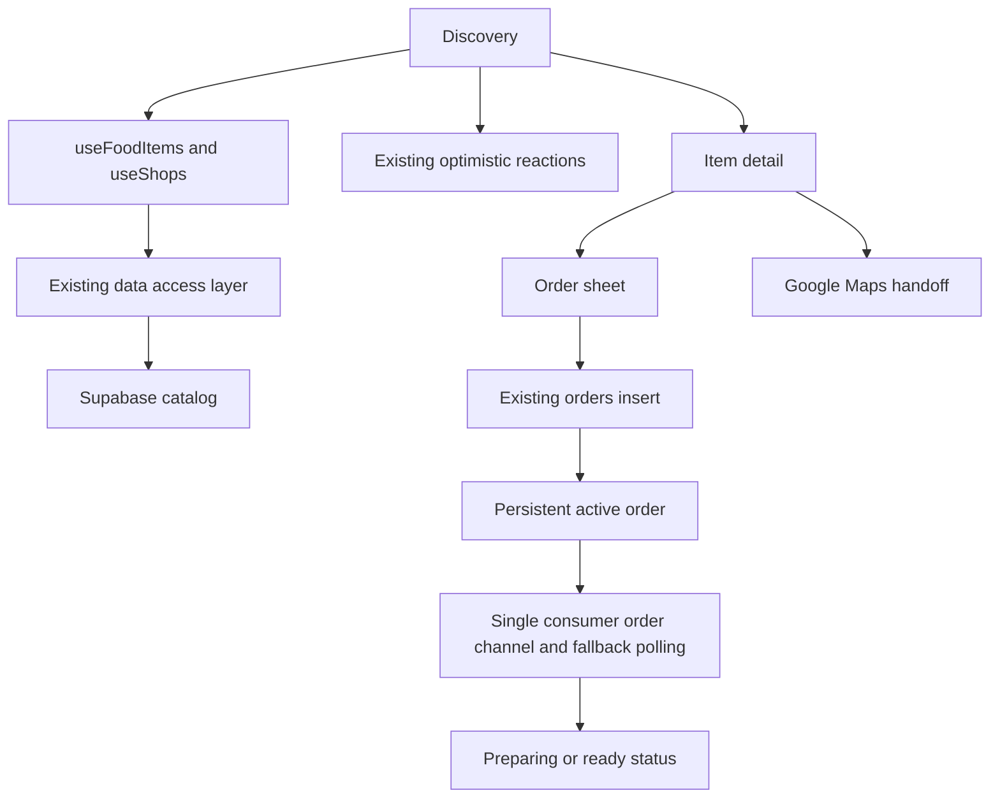

> Archived: the Mint / Forest consumer redesign was rolled back at the user’s request. The earlier interface is active; business PIN security fixes remain in place.

# YemEmUnnai consumer interface and system blueprint

The consumer discovery to token flow now uses a dark forest palette, readable menu cards, and responsive sheets. The design prioritizes a quick decision during a MITS lecture break. The business workspace retains its green and light surface design and server verified PIN login.

## Scope and requirements

The subsequent approved audit also migrated FeedbackModal, LocationPermissionScreen, InstallPrompt, BrandIntroSplash, and ErrorBoundary. See [the component audit](design-system-audit.md) for exact findings, the full token and utility catalog, and the remaining intentional boundaries. The final local build emits the application entry at 19.02kB gzip, feedback at 1.32kB gzip, and the welcome route at 0.47kB gzip. The largest raw chunk is 218833 bytes. Local Vite builds took about two seconds after the cache was warm; complete watchdog checks also include TypeScript and lint startup time.

Implemented screens are HomeDiscoveryScreen, FoodItemDetailScreen, QuickOrderModal, WalkInMapModal, and the shared order status shell. React 19, Tailwind 4 and plain CSS remain the implementation stack. No dependency was added. Existing safeStorage, optimistic reaction reconciliation, Supabase client singleton, and multiplexed consumer order channel remain in use.

This blueprint documents the implementation rather than promising a capacity result. A 300 concurrent student load test, real screen reader walk, and a physical iOS and Android device check have not been run. The existing order system creates a three digit token from the order UUID; it does not guarantee uniqueness among concurrent orders. The full order UUID remains the tracking identifier. For a busy counter, use a server issued unique daily token before claiming collision free pickup numbers.

No repository AGENTS.md or design convention document was found in reconnaissance. The user supplied better accessibility, layout, writing, colors, UI and interface rules; better typography was also read as required by better interface.

## Color roles

Consumer tokens live in `.consumer-ui` in `src/index.css`. Business tokens remain outside that scope. Components use semantic variables rather than referencing primitives. Status labels supply a text cue alongside color.

| Role | Value | Usage |
| --- | --- | --- |
| Page | #0B1510 | Canvas and image loading background |
| Surface | #112019 | Cards and sheets |
| Hover surface | #192D23 | Neutral actions and hovered surfaces |
| Primary text | #F8FAF8 | Titles and body |
| Secondary text | #B7C9BF | Metadata and field hints |
| Primary action | #10B981 | Checkout and map handoff |
| On action | #0B1510 | Text on mint |
| Live | #6EE7B7 on #123226 | In stock labels |
| Warm | #F59E0B on #302414 | Published stock counts |
| Closed | #FDA4AF on #341C23 | Closed and sold out labels, errors |
| Border | #425E4F | Controls and structure |
| Focus | #F8FAF8 | 2px ring with 3px offset |

Measured WCAG 2 text contrast: primary on page 17.73:1, primary on surface 16.09:1, secondary on surface 9.74:1, secondary on hover 8.41:1, dark text on mint 7.33:1, live badge 9.12:1, warm badge 7.04:1, closed badge 8.31:1. All defined text pairs are at least 4.5:1. Image badges have opaque backgrounds, avoiding dependence on the photograph. Run `node scripts/check_consumer_colors.cjs` to remeasure these exact tokens.

## Typography and geometry

Plus Jakarta Sans remains the existing web font, with system sans serif fallback. The Adobe Fonts initialization failed with an internal service error, so no Adobe font was recommended, licensed, or installed. The unused Fredoka request is removed. Font swapping remains enabled.

| Property | Scale or rule |
| --- | --- |
| Hero heading | 32 to 44px responsive, weight 800, line height 1.08 |
| Detail heading | 28px, weight 800 |
| Sheet heading | 24px, weight 800 |
| Section heading | 18px, weight 800 |
| Body | 14px, line height 1.5 |
| Inputs | 16px, preventing iOS input zoom |
| Metadata | 11 to 12px, weight 400 or greater |
| Spacing | 4, 8, 12, 16, 20, 24, 28px |
| Food card radius | 24px outside, 16px image, 8px padding |
| Action radius | 12 to 16px |
| Sheet radius | 32px |
| Elevation | Inner white highlight at 8 percent, low opacity ambient shadow |
| Touch target | Minimum 44 by 44px for consumer controls |

Heading text balances and long names wrap. Prices and quantities use tabular figures. Useful text remains selectable. Desktop shows a centered shell up to 640px wide, with three food columns at 48rem. Mobile takes the full viewport, with two columns and safe area padding. Filters remain in a sticky navigation row. Horizontal shop scrolling retains a scrollbar and visible next item where space permits.

## Component contracts

Food cards show an image, stock label, dietary label when provided, shop, available location or walk metadata, price, reactions, and a neutral quick order or directions action. No freshness countdown, rating, discount or walking time is invented. Hot deals only includes items with a real original price greater than the current price. An empty deal view points back to the menu. The API's existing dietary classification is still inferred from item names, not a verified allergen source; vendor supplied structured dietary data is needed before stronger claims.

Detail pages use normal flow and a sticky bottom action. Quantity is one to ten. The old fabricated double portion discount and unsaved favorite action were removed. The displayed total is the same unit price times quantity used in checkout. Walk in items hand off to directions.

Checkout uses visible labels, native required field validation, a ten digit Indian phone pattern, and a campus location field. It explains that payment and collection are handled by the shop. A synchronous request lock prevents duplicate submissions. Busy state disables the form and closing; failure preserves inputs and offers retry. The successful token remains until dismissed and is pinned immediately to the shared order shell. Reduced motion suppresses confetti and vibration. The preview cannot create a false successful order without a configured backend.

Map coordinates are only used when finite values exist. Location access occurs after selecting Use my location. A GPS result is described as straight line distance, never a walking route. A denied request explains recovery through browser permission or Google Maps. The schematic is explicitly illustrative. A real link opens walking directions in Google Maps when coordinates exist, otherwise a shop search, with a new tab announcement.

## Data and state flow

The active order UUID, token, shop, and status persist through safeStorage, with shape validation on restore and safe failure when storage is unavailable. Phone and campus location are not added to local storage by this change. Reactions retain the existing server reconciliation behavior. Consumer subscriptions still share one Realtime connection per client; the existing eight second fallback poll remains. Catalog refresh failures now announce an error, disable stale ordering, and offer Retry menu rather than substituting a sample menu. Empty live results clear the list.

Business authentication uses the deployed vendor PIN Edge Function and service only RPC. Public bundles include outlet IDs and names, never PINs or administrative keys. Five failed attempts lock a cafe for fifteen minutes; row locking keeps concurrent failures atomic. Each successful login exchanges a single use token for a Supabase session and checks the exact cafe owner. Legacy API keys are being retired as part of rollout; final rollout status is recorded in the interface verification report.

## Accessibility and motion

Native buttons and links provide keyboard paths. The app has one main landmark and a skip link. The shared modal hook traps focus, marks background sibling branches inert, locks background scrolling, handles Escape, and restores focus when the trigger still exists. Sheets scroll within the viewport and contain overscroll. Status and toast regions exist before text updates. Errors persist while relevant. Focus remains visible and forced colors uses the system Highlight color.

Interactive transitions name their properties and take 150ms with cubic bezier 0.2, 0, 0, 1. Consumer press feedback uses the user requested 0.98 scale. Sheet entry uses 16px movement over 300ms. No animation dependency was added; CSS approximates the requested spring entrance without a physics engine. Motion runs only under no preference; reduced motion also disables transforms and hides animated steam. The splash advances in 900ms or immediately under reduced motion.

## Performance and checks

Food imagery reserves a 4 to 3 aspect ratio and explicit intrinsic dimensions, loads lazily, and decodes asynchronously. Shop imagery reserves its size. Detail images load with high priority. Menu loading uses reserved skeleton cards. These reduce layout movement; zero CLS has not been established by a field measurement.

Vite keeps React, Supabase and UI vendor chunks separate. Detail, map, feedback and business routes remain lazy. The verified build before final documentation edits emitted detail at 1.20kB gzip, map at 1.85kB gzip, and the application entry at 19.36kB gzip. These numbers exclude shared vendor chunks and images. They are build sizes, not a measured rush hour capacity guarantee.

`scripts/check_consumer_ui.cjs` uses an available Playwright installation with backend writes intercepted. It checks five widths, all and category filtering, sold out and empty states, keyboard detail entry, map handoff, inert background, checkout error and retry, persistent tokens, RTL and text resizing. Set PLAYWRIGHT_PACKAGE to the installed module path and QA_ORIGIN to a preview or production URL. It does not place actual orders. PIN handler assertions remain in `supabase/test_vendor_pin.mjs`; its live mode verifies all five owners, attempt locking and replay protection.

## Document export limitation

Frontend rollout is complete at https://yemunnai.vercel.app. The old legacy API keys have been disabled and the deployed app uses modern keys. The component audit records verification and remaining coverage limits.

The invoked System Design template was found and its artifact-template.json read. Its retained reference.docx remains unchanged. The Documents capability instructions were read, but the required managed workspace dependency runtime and document render pipeline are not advertised or available in this Windows workspace. DOCX authoring was stopped at that prerequisite as required by the skill. This Markdown file is the persistent repository blueprint, not a claim of a rendered template derived Word document.
